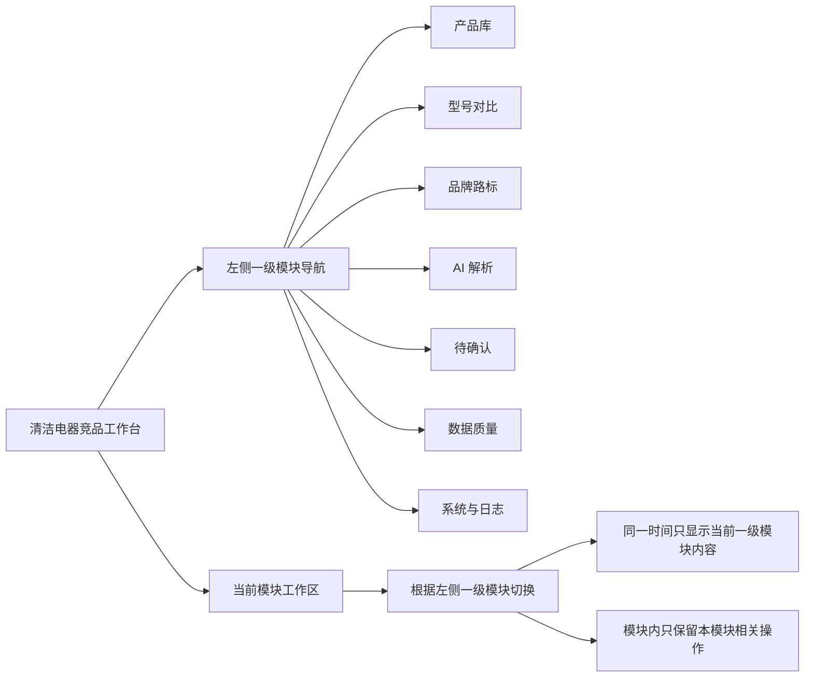
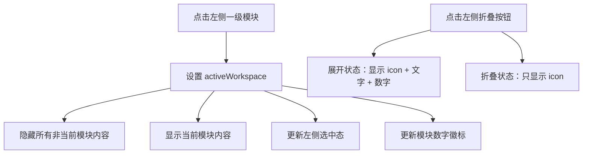

# 现有网站功能架构图

> 用途：作为后续调整功能模块的对齐图。调整时优先说明要移动、删除或新增哪个一级模块，以及它下面的二级内容。

## 总体结构



## 一级模块与内容归属

```mermaid
flowchart TD
  Root["网站功能模块"] --> Products["产品库"]
  Root --> Compare["型号对比"]
  Root --> Roadmap["品牌路标"]
  Root --> Import["AI 解析"]
  Root --> Review["待确认"]
  Root --> Quality["数据质量"]
  Root --> System["系统与日志"]

  Products --> P1["搜索与筛选"]
  Products --> P2["概览指标：产品数 / 平均价格 / 待人工确认 / 覆盖品牌"]
  Products --> P3["产品表格"]
  Products --> P4["产品详情"]
  Products --> P5["列设置"]
  Products --> P6["保存视图与高级筛选"]
  Products --> P7["下载产品库信息"]

  Import --> I1["详情页 URL 抓取并分析"]
  Import --> I2["上传长图 / 截图 / PDF"]
  Import --> I3["补充说明"]
  Import --> I4["分析进度与错误提示"]
  Import --> I5["结构化入库或进入人工复核"]
  Import --> I6["手动新增产品"]

  Import --> R1["待确认产品列表"]
  Import --> R2["查看待确认产品"]
  Import --> R3["确认单个产品"]
  Import --> R4["全部确认"]

  Quality --> Q1["数据质量检查"]
  Quality --> Q2["高 / 中 / 低优先级切换"]
  Quality --> Q3["问题列表滚动查看"]
  Quality --> Q4["查看问题关联产品"]
  Quality --> Q5["导出问题"]

  Compare --> C1["选择至少 2 个型号，不限制上限"]
  Compare --> C2["使用当前筛选结果"]
  Compare --> C3["同品类相近价位推荐"]
  Compare --> C4["对比字段选择"]
  Compare --> C5["参数矩阵与差异高亮"]
  Compare --> C6["500 字以内竞争对标总结"]
  Compare --> C7["导出对比表"]
  Compare --> C8["自定义对比元素"]

  Roadmap --> M1["单品牌时间模式"]
  Roadmap --> M2["品牌对比模式"]
  Roadmap --> M3["品类 / 品牌多选 / 状态 / 半年度周期筛选"]
  Roadmap --> M4["产品卡片：名称 / 价格 / Top3 卖点"]
  Roadmap --> M5["各品牌 PDF"]
  Roadmap --> M6["导出图片"]
  Roadmap --> M7["导出路标"]

  System --> S1["系统状态"]
  System --> S2["AI Provider 配置状态"]
  System --> S3["AI 用量与错误监控"]
  System --> S4["用量导出"]
  System --> S5["审计日志"]
  System --> S6["审计导出"]
  System --> S7["导出数据包"]
```



## 当前交互规则



## 模块调整建议口径

后续调整时，建议按这个格式描述需求：

```text
把【模块 A】里的【功能 X】移动到【模块 B】；
删除【模块 C】；
新增一级模块【模块 D】，里面包含【功能 1 / 功能 2】；
【功能 Y】不要再出现在其他一级模块里。
```

## 当前模块边界

| 一级模块 | 当前定位 | 主要内容 |
| --- | --- | --- |
| 产品库 | 日常查询和查看产品 | 搜索筛选、概览指标、产品表、产品详情 |
| 型号对比 | 竞品对比分析 | 型号选择、字段选择、矩阵、总结、导出、自定义字段 |
| 品牌路标 | 品牌节奏和价格层级 | 单品牌时间、品牌对比、路标导出 |
| AI 解析 | 新资料录入与人工复核入口 | URL 抓取、文件上传、AI 分析、入库、待确认列表、查看、确认、批量确认 |
| 待确认 | 已合并到 AI 解析 | 不再作为独立一级模块 |
| 数据质量 | 数据问题处理 | 优先级问题、问题查看、问题导出 |
| 系统与日志 | 运行监控和追溯 | 系统状态、AI 用量、错误、审计日志 |

## 当前边界变化

- 取消顶部全局操作区，避免每个一级模块重复出现同一批按钮。
- 取消页面上的导入入口；底层数据包导入能力保留给验收和迁移对账使用，但不作为主界面功能展示。
- 产品库导出放在产品库模块内。
- 型号对比导出放在型号对比模块内。
- 品牌路标导出放在品牌路标模块内。
- 数据质量、AI 用量、审计日志的导出放在对应模块内。
- 添加详情页和手动新增产品放在 AI 解析模块内。
- 待确认队列合并到 AI 解析模块内，不再保留独立一级标签。
- 品牌路标使用半年度周期，品牌筛选为多选并排除未确认产品。
